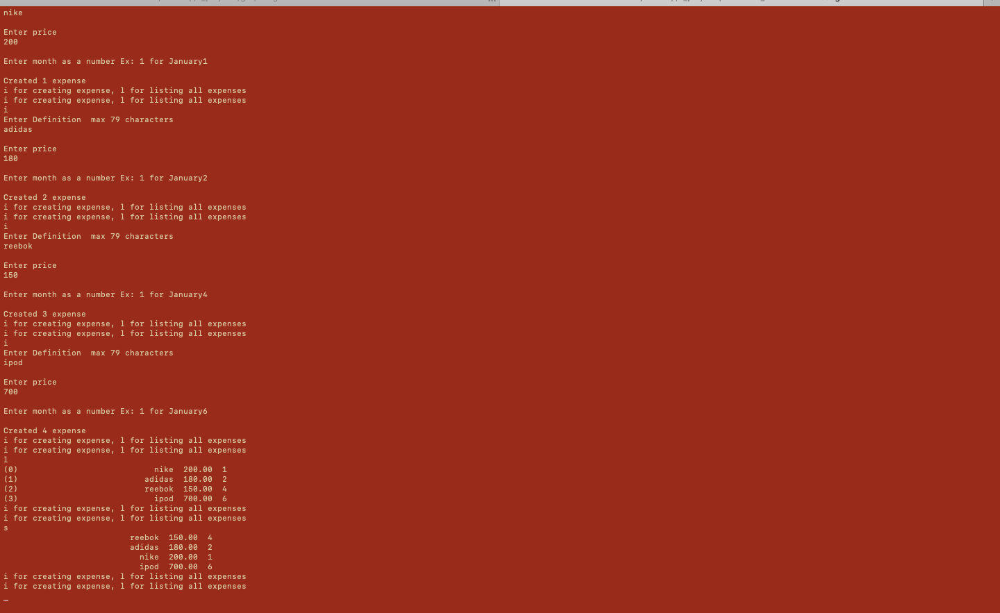

# BudgetControl :maple_leaf:

Budget CLI

 
*  This program is written for managing monthly expences and budget
 
*  Program a budget planner for the available monthly capital and the monthly cost of living informa7on 
*  such as rent, food, telephone costs, etc.

*  For the months January to December. Use a suitable structure array for this. (Array of months)

*  Allow you to enter individual values in a monetary currency of your choice. (Define an enum for currencies)

*  Save the entries in a suitable structure array with variable amount of entries.(Define a customtype with struct and make a linked list)

*  Enable the entry of new items with their data and a list func7on that displays the budget planner .(Read and print entries)

*  Implement add, delete, sort, search and list func7ons in your code

*  Write and read your data in and from a file with the name “budget.txt".
 
 
 
## Done:
   * [x] Created Linked List For Expense Struct(It is not like Arrays it is dynamic Grows and shrinks):maple_leaf:
   * [x] Functions created for adding new expenses and removing all expenses for freeing allocated mem space:maple_leaf:
   * [x] User is able to enter description(float),price(float),month(int) to expense type while adding new expense:maple_leaf:
   * [x] Listing functionallity added:maple_leaf:
   * [x] Sort functionality added by implementing Bublee sort algorithm:maple_leaf:

## Todo:
   * [ ] Delete only selected item
   * [ ] Search
   * [ ] Read and write
   * [ ] Add currency
## Compile & Run
### Compile:
            - gcc budget.c expense.c common_actions.c -o budget
### Run:
            - ./budget
### **Contributors**
 
 

  
  
   
  
    
      

      
